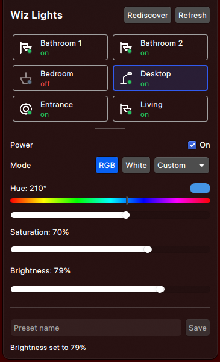

# Wiz Lights CLI + Plasma Widget

Control local Philips Wiz bulbs from the `wizctl` CLI and a KDE Plasma widget.



## Features

- Control Wiz bulbs directly over the LAN via UDP port `38899`.
- Use friendly light names stored in `~/.wiz-cli/config.json`.
- Rediscover bulb IPs by matching stable MAC addresses.
- Bootstrap light config interactively by blinking discovered bulbs.
- Use shipped RGB, White, and Scene presets.
- Save custom presets in `~/.wiz-cli/presets.json`.
- Control lights from a convenient Plasma widget.

## Requirements

- Python 3
- (Optional) KDE Plasma with `kpackagetool5` or `kpackagetool6` for widget installation

## Setup

```bash
git clone git@github.com:abgita/wiz-cli.git
cd wiz-cli
./wizctl discover --interactive
```

## Configuration

Runtime files live in `~/.wiz-cli/`:

| File | Purpose |
| --- | --- |
| `~/.wiz-cli/config.json` | Light names, IP addresses, and MAC addresses. |
| `~/.wiz-cli/presets.json` | User-saved presets and overrides. |

## `wizctl` usage

```bash
wizctl list
wizctl list --json
wizctl status living
wizctl status --all
wizctl on living
wizctl off bedroom
wizctl dim desktop 65
wizctl hsv living 210 70 80
wizctl hsv-preview 210 70 80
wizctl temp living 2700 100
wizctl scene living 6 80
wizctl preset living Cozy
wizctl presets
wizctl presets --json
wizctl save-preset living MyPreset
wizctl discover
wizctl discover --interactive
wizctl discover --subnet 192.168.0.0/24
wizctl discover --dry-run
```

`wizctl hsv` sets color from HSV; value is brightness. `wizctl hsv-preview` shows the resulting RGB without changing a light.

`wizctl presets` returns shipped defaults from `presets.json` merged with user presets from `~/.wiz-cli/presets.json`; user presets with the same name override defaults.

## Pi skill

This repo includes a Pi skill so a Pi agent can use `wizctl` to control your configured lights.

Install it standalone from GitHub:

```bash
pi install git:github.com/abgita/wiz-cli
```

Or install it from a local checkout:

```bash
pi install .
```

For one-off use without installing, run Pi from the repo root with:

```bash
pi --skill ./SKILL.md
```

## Plasma widget

Install or upgrade the widget with:


```bash
./install.sh
```

The installer:

- creates `~/.wiz-cli/`
- symlinks `wizctl` to `~/.local/bin/wizctl`
- installs or upgrades the Plasma widget

> Make sure `~/.local/bin` is available in the PATH used by Plasma.

Uninstall the widget and `~/.local/bin/wizctl` symlink:

```bash
./uninstall.sh
```

Remove saved light config and user presets too:

```bash
./uninstall.sh --purge
```

For development reloads:

```bash
./reload-plasma-widget.sh
```
